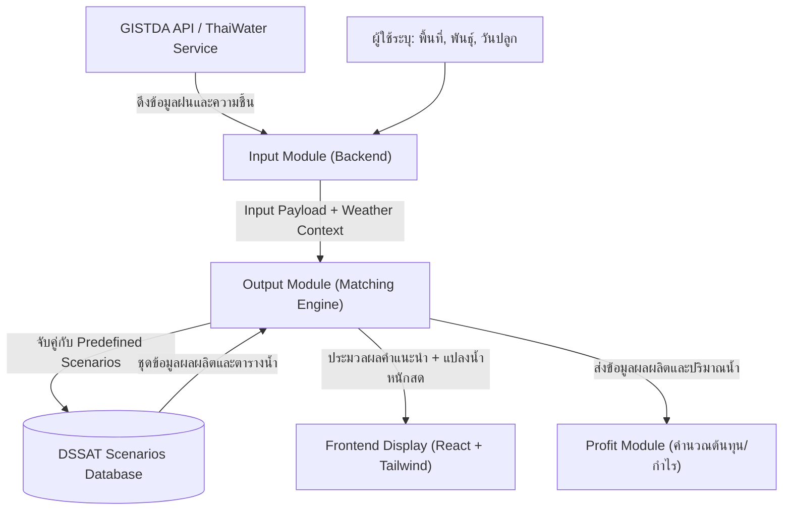
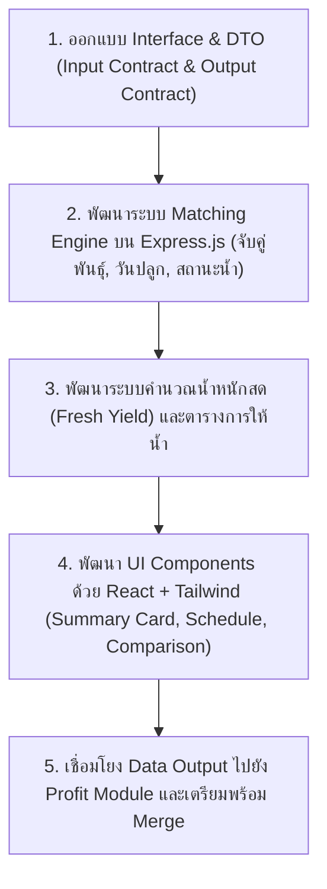

# WarMa: Water Resources Management Advisor
## เอกสารข้อกำหนดระบบ สถาปัตยกรรม และแนวทางการพัฒนาฉบับสมบูรณ์ (Master System Specification & Architecture Document)

---

### ข้อมูลโครงการและโครงสร้างทีมงาน (Project & Team Metadata)
* **ชื่อโครงการ:** WarMa (Water Resources Management Advisor — เว็บแอปพลิเคชันแนะนำการจัดการทรัพยากรน้ำเพื่อการเกษตร)
* **รายวิชา:** EN813701 Web Application Development (ปีการศึกษา 2026)
* **โครงสร้างการทำงานของทีม (Team & Project Structure):**
  * โครงการนี้เดิมถูกกำหนดให้แบ่งเป็น 2 กลุ่มแยกกัน แต่ทางอาจารย์ประจำวิชาและคณะเกษตรศาสตร์ต้องการให้ทำโครงการเดียวกัน จึงรวมกันเป็น **1 โครงการใหญ่ พัฒนาร่วมกัน 4 คน**
  * โครงสร้างแบ่งเป็น **2 กลุ่มย่อย (Subgroups) กลุ่มละ 2 คน**
  * **ข้อกำหนดการพัฒนา (Development Requirement):** สมาชิกทุกคนต้องมีบทบาทและประสบการณ์ทำทั้ง **Frontend และ Backend** (Full-Stack Contribution) โดยไม่แบ่งแยกฝ่ายใดฝ่ายหนึ่งทำเฉพาะส่วน
  * **กลยุทธ์การบริหาร Git (Branching & Workflow Strategy):** ในช่วงแรกทั้ง 2 กลุ่มแยก Branch/Repository กันพัฒนาอย่างอิสระเพื่อความคล่องตัว โดย:
    * `develop`: เป็น Branch การทำงานของเพื่อนร่วมทีมกลุ่มย่อยที่ 1
    * `output-dev`: เป็น Branch หลักของฉันสำหรับพัฒนาโมดูล **`Output`**
    * มีการกำหนด Interface และ Data Contract ที่ชัดเจน เพื่อรวมโค้ด (Merge) ทั้งหมดเข้าด้วยกันในภายหลัง
* **มาตรฐานเทคโนโลยีหลักของโครงการ (Agreed Project Tech Stack):**
  * **Frontend:** React + Tailwind CSS
  * **Backend:** Node.js + Express.js
  * *(หมายเหตุเชิงสถาปัตยกรรม: ใน Branch `develop` เพื่อนร่วมทีมได้ทำ Prototype เบื้องต้นด้วย Next.js และ NestJS เพื่อทดสอบระบบ แต่ Tech Stack มาตรฐานที่ตกลงร่วมกันทั้ง 4 คนสำหรับแกนหลักของโปรเจกต์คือ React + Tailwind CSS และ Node.js + Express.js)*
* **การแบ่งขอบเขตความรับผิดชอบ 4 ด้านหลัก (4 Core Responsibilities):**
  1. **Admin:** ระบบจัดการชุดข้อมูลสถานการณ์จำลอง (Scenario Management), การตั้งค่าระบบ และการยืนยันตัวตน
  2. **Input:** ระบบรับข้อมูลแปลงปลูก, แผนที่ดาวเทียม/พิกัด, ข้อมูลชุดดิน, พันธุ์, วันปลูก และการดึงข้อมูลสภาพอากาศ/ฝน
  3. **Output (ส่วนที่ฉันรับผิดชอบหลัก):** การนำ User Input $\rightarrow$ จับคู่/วิเคราะห์กับ Predefined Scenarios $\rightarrow$ ประมวลผลผลลัพธ์ $\rightarrow$ แสดงผลลัพธ์ให้ผู้ใช้เข้าใจง่าย
  4. **Profit:** ระบบคำนวณความคุ้มค่าทางเศรษฐศาสตร์ ต้นทุนการผลิต ค่าน้ำ ค่าปุ๋ย ค่าแรง และกำไรสุทธิคาดการณ์

---

## 1. บทนำและแนวคิดโครงการ (Introduction & Vision)

### 1.1 ที่มาและความสำคัญ (Motivation)
การจัดการน้ำสำหรับเกษตรกรรมในประเทศไทยเป็นปัญหาเชิงโครงสร้าง เกษตรกรส่วนใหญ่ยังขาดเครื่องมือสนับสนุนการตัดสินใจ (Decision-Support Tools) ที่ใช้งานได้จริงในภาคสนาม 

ในขณะที่อาจารย์และนักวิจัย คณะเกษตรศาสตร์ มีชุดข้อมูลจำลองการเจริญเติบโตของพืชที่ผ่านการรันแบบจำลองระดับโลกอย่าง **DSSAT (Decision Support System for Agrotechnology Transfer)** ซึ่งมีความละเอียดและแม่นยำสูง ทว่าโปรแกรม DSSAT มีความซับซ้อน ติดตั้งและใช้งานยาก เป็นซอฟต์แวร์แบบดั้งเดิม (Desktop/Legacy) และข้อมูลผลการทดลองส่วนใหญ่ยังคงถูกจัดเก็บแยกส่วนอยู่ในคอมพิวเตอร์ส่วนบุคคลของอาจารย์ ทำให้ไม่สามารถถ่ายทอดความรู้นี้ไปสู่เกษตรกรได้อย่างกว้างขวาง

### 1.2 พันธกิจและเป้าหมาย (Mission & Objectives)
* **Mission:** พัฒนา Web Application บนมาตรฐาน Mobile-First ที่ช่วยให้เกษตรกร นักศึกษา และบุคคลทั่วไป สามารถเข้าถึงคำแนะนำการจัดการน้ำและผลผลิตคาดการณ์ได้อย่างรวดเร็ว โดยซ่อนความซับซ้อนของ DSSAT ไว้เบื้องหลัง
* **Key Concept:** "ลด Input ที่ไม่จำเป็น $\rightarrow$ จับคู่สถานการณ์จำลองที่คำนวณไว้ล่วงหน้า (Predefined Scenario Matching) $\rightarrow$ แสดงผลลัพธ์เป็นน้ำหนักสดและตารางให้น้ำที่ปฏิบัติได้จริง"
* **ขอบเขตพืชและพื้นที่:** เจาะจงที่ **มันสำปะหลัง (Cassava)** ในพื้นที่จังหวัดขอนแก่น และจังหวัดอุดรธานี

---

## 2. การวิเคราะห์บันทึกลายมือในเอกสารโจทย์ (Handwritten Notes Analysis)

จากการตรวจสอบและวิเคราะห์ข้อความลายมือ (Handwritten Notes) ที่จดบันทึกไว้ระหว่างที่อาจารย์อธิบายโจทย์ในเอกสาร `docs/web-app-projects-topics-2026 (1).pdf` สามารถถอดความ ตีความในบริบท และแยกแยะระหว่าง **ข้อกำหนดจริง (Requirements)** กับ **แนวคิดประกอบ (Notes/Ideas)** ได้ดังนี้:

### 2.1 หน้าที่ 1 (Page 1) — การคัดเลือกสายพันธุ์และปัจจัยการจับคู่
* **การคัดเลือกสายพันธุ์มันสำปะหลัง (Genotype):**
  * มีการทำเครื่องหมายดอกจันสีแดง `*` และวงกลมล้อมรอบ 3 สายพันธุ์ พร้อมใส่วงเล็บปีกกา `{ 3` ทางด้านซ้าย ได้แก่:
    1. `1.1 พันธุ์เกษตรศาสตร์ 50` *(วงกลม + เครื่องหมาย `*`)*
    2. `1.2 ระยอง 9` *(วงกลม + เครื่องหมาย `*`)*
    3. `1.5 CMR38-125-77` *(วงกลม + เครื่องหมาย `*`)*
  * มีการกาเครื่องหมายกากบาทสีแดง `x` ทับที่:
    * `1.3 ระยอง 72` *(ตัดออก / ไม่เน้นในชุดทดลองแรก)*
    * `1.4 ห้วยบง 90` *(ตัดออก / ไม่เน้นในชุดทดลองแรก)*
  * *การตีความ:* **[Required Feature]** อาจารย์กำหนดให้โฟกัสที่ 3 สายพันธุ์หลัก (เกษตรศาสตร์ 50, ระยอง 9, CMR38-125-77) สำหรับสร้างชุด Scenarios เริ่มต้น
* **วันปลูก (Planting Date):**
  * มีลูกศรชี้จาก `2.1 ปลูกต้นฤดูฝน (พ.ค. - มิ.ย.)` โดยเฉพาะช่วง `1 พ.ค.`
  * มีตัวเลือก `2.2 ปลูกปลายฤดูฝน (ต.ค. - พ.ย.)`
* **ข้อความด้านล่างหน้ากระดาษ:**
  * ลายมือระบุ: `แบ่ง scene` | `* [วงรี: วัน-พันธุ์] combi` | `ท่อนพันธุ์ (ขีดเส้นใต้) อาศัยน้ำฝน (ขีดเส้นใต้)`
  * *การตีความ:* **[Core Requirement]** การแบ่งชุด Scenario ให้ใช้การผสมผสาน (Combination) ระหว่าง **"วันปลูก"** และ **"สายพันธุ์"** เป็นแกนหลัก โดยพิจารณาเงื่อนไขของท่อนพันธุ์และการเพาะปลูกแบบอาศัยน้ำฝน

### 2.2 หน้าที่ 2 (Page 2) — สภาพอากาศ, ดิน, GISTDA และขอบเขตการจำลอง
* **ลายมือด้านบน:** `เลือกพันธุ์ วันไหนให้เยอะ` $\rightarrow$ `DSSAT` $\rightarrow$ `สนใจแค่วันก่อน`
  * *การตีความ:* จุดประสงค์ที่เกษตรกรต้องการรู้มากที่สุดคือ "ถ้าเลือกพันธุ์นี้ ปลูกวันไหนจะได้ผลผลิตเยอะที่สุด" โดยในแบบจำลอง DSSAT ให้เริ่มโฟกัสที่ตัวแปรวันปลูกก่อน
* **ลายมือมุมซ้ายบน:** `[วงรี: อากาศ จาก gisda]` โยงเส้นลงมาที่คำว่า `ร่วมกัน`
  * โยงต่อไปยัง 2 แกน:
    1. `* [วงรี: พันธุ์ - การให้น้ำ]`
    2. `[วงรี: ดิน - พันธุ์]` $\rightarrow$ `Input Sim หลายแบบ`
  * *การตีความ:* **[Key External Requirement]** มีการนำ **"ข้อมูลสภาพอากาศจาก GISTDA (gisda)"** เข้ามาร่วมวิเคราะห์กับชุดความสัมพันธ์ระหว่างพันธุ์พืชและการให้น้ำ รวมถึงชุดดินและพันธุ์
* **ลายมือชุดข้อมูลสภาพอากาศ:** `เริ่มจำแนกชุด อากาศ 30 ปี` และ `* คุม ดิน + ปี Data จะได้เยอะ`
  * *การตีความ:* ข้อมูลสภาพอากาศใน DSSAT มีฐานข้อมูลย้อนหลัง 30 ปี หากระบบควบคุมตัวแปรดิน (ชุดดิน) และปีสภาพอากาศ จะสามารถสร้าง Data การจำลองล่วงหน้าได้ครอบคลุมหลายสถานการณ์
* **ลายมือกลุ่มเป้าหมาย:** `ตัดสินใจ เกษตรกร / คนทั่วไป / Web`
  * *การตีความ:* ยืนยันว่าระบบต้องเป็น Web App ที่เกษตรกรและบุคคลทั่วไปสามารถใช้ช่วยตัดสินใจได้จริง
* **ลายมือข้อจำกัดของระบบ:** `นอกเหนือ (ตอบไม่ได้) / (เอาแค่เท่าที่มี / พัฒนาต่อไป)`
  * *การตีความ:* **[Crucial Constraint]** อาจารย์ระบุชัดเจนว่า หากผู้ใช้ป้อนข้อมูลนอกเหนือจาก Scenarios ที่มีอยู่ ระบบไม่จำเป็นต้องเดาคำตอบ (ให้แจ้งว่าตอบไม่ได้/ไม่มีข้อมูล) โดยให้ทำครอบคลุม "เอาแค่เท่าที่มีข้อมูลก่อน" แล้วค่อยพัฒนาต่อยอด
* **ลายมือด้านล่างสุด:** `ระยะปลูกไม่ sensitive`
  * *การตีความ:* **[Scope Reduction Confirmation]** ระยะปลูกไม่มีผลต่อความผันแปรของผลผลิตอย่างมีนัยสำคัญ ตรงกับ Finding 4 ในเอกสาร checkpoint จึงตัดออกจาก Input ที่บังคับกรอก

### 2.3 หน้าที่ 3 (Page 3) — ข้อมูลนำเข้า, การแปลงผลผลิต และฟีเจอร์เศรษฐศาสตร์
* **ปัจจัยนำเข้า:** `พันธุ์ / วันปลูก / ชื่อชุดดินที่นิยมปลูกมัน / การให้น้ำ /`
  * ใต้การให้น้ำมีแขนงแยก: `ขนาดพื้นที่` $\rightarrow$ `ปริมาณ  ความถี่`
  * *การตีความ:* ปัจจัยนำเข้าหลักต้องประกอบด้วย: ชนิดพันธุ์, วันปลูก, ชื่อชุดดินที่นิยมปลูกมันสำปะหลัง, และรูปแบบการให้น้ำ (ซึ่งต้องสัมพันธ์กับขนาดพื้นที่ เพื่อคำนวณปริมาณและความถี่)
* **ผลลัพธ์และการแปลงค่า:** `ผลเป็นแห้ง (ขีดเส้นใต้ 2 เส้น)  รู้แต่น้ำหนัก`
  * *การตีความ:* **[Strict Output Requirement]** แบบจำลอง DSSAT ให้ผลลัพธ์เป็นน้ำหนักแห้ง (Dry Weight) แต่อาจารย์เน้นย้ำว่าเกษตรกร "รู้และใช้แต่น้ำหนักสด" (ชั่งกิโลขาย) ระบบจึงต้องแปลงผลลัพธ์ให้ออกมาเป็น **น้ำหนักสด (Fresh Weight)** เสมอ
* **ปุ๋ยไนโตรเจน:** `ปุ๋ย N - ไม่ใส่ / - ใส่ ตามคำแนะนำ`
  * *การตีความ:* ตัวแปรปุ๋ย N ไม่ต้องให้ผู้ใช้กรอกเป็นตัวเลขละเอียด แต่ให้มีเพียง 2 กรณีใน Scenario คือ ไม่ใส่ปุ๋ย หรือใส่ตามคำแนะนำมาตรฐาน
* **สภาพอากาศ:** `อากาศในอนาคตร่วมด้วย  ไม่ย้อนหลัง`
  * *การตีความ:* คำแนะนำการจัดการน้ำต้องนำข้อมูลพยากรณ์อากาศล่วงหน้ามาร่วมตัดสินใจ ไม่ใช่ยึดเฉพาะสถิติสภาพอากาศย้อนหลังเพียงอย่างเดียว
* **ระบบหลังบ้าน:** `Admin panel มี ก็ดี`
  * *การตีความ:* **[Priority Note]** อาจารย์มองว่า Admin Panel เป็นส่วนเสริมที่มีก็ดี แต่ Core สำคัญที่สุดคือระบบจับคู่และแสดงผลคำแนะนำแก่เกษตรกร
* **มิติเศรษฐศาสตร์:** `กำไร  ต้นทุน`
  * *การตีความ:* **[Required Module — Profit]** เป็นที่มาของโมดูลที่ 4 (Profit) ที่ต้องคำนวณต้นทุนและกำไรให้เกษตรกรเห็นความคุ้มค่าทางเศรษฐกิจ

---

## 3. การวิเคราะห์การเชื่อมต่อ GISTDA API (GISTDA API Integration Analysis)

### 3.1 บทบาทและวัตถุประสงค์ของ GISTDA API ในระบบ
จากบันทึกที่ระบุว่า `"อากาศ จาก gisda"` ร่วมกับความต้องการพยากรณ์สภาพอากาศ:
* **วัตถุประสงค์หลัก:** นำข้อมูลภูมิสารสนเทศและสภาพอากาศจากสำนักงานพัฒนาเทคโนโลยีอวกาศและภูมิสารสนเทศ (GISTDA) มาใช้สนับสนุนการประเมินสถานการณ์น้ำและการเพาะปลูก
* **ประเภทข้อมูลที่เกี่ยวข้อง:**
  1. ข้อมูลปริมาณน้ำฝนสะสมและฝนพยากรณ์ (Rainfall Monitoring & Forecast)
  2. ข้อมูลความชื้นในดิน (Soil Moisture Index)
  3. ดัชนีความแห้งแล้งเชิงพื้นที่ (Drought Risk / SPI)
  4. พิกัดและขอบเขตแปลงเกษตรกรรม

### 3.2 การเปรียบเทียบแหล่งข้อมูลสภาพอากาศในโปรเจกต์
ในโปรเจกต์มีการอ้างอิงถึง 3 แหล่งข้อมูลสภาพอากาศ:
1. **GISTDA API:** ระบุในบันทึกลายมือของอาจารย์ เพื่อใช้ดึงข้อมูลสภาพอากาศ/ความชื้นเชิงพื้นที่ในประเทศไทย
2. **ThaiWater API (สสน.):** ปัจจุบันมี Implementation อยู่ใน Branch `develop` (`backend/src/rainfall/rainfall.service.ts`) ดึงข้อมูลปริมาณฝน 24 ชั่วโมงย้อนหลังจากสถานีวัดน้ำทั่วประเทศ พร้อมพิกัด Lat/Long และ Cache 10 นาที
3. **Open-Meteo / TMD API:** ระบุใน Proposal เบื้องต้นสำหรับดึงพยากรณ์ฝน 3 วัน และสถิติย้อนหลัง

> `[TODO / NEED CLARIFICATION]`: ต้องสอบถามอาจารย์/ผู้ประสานงานเพิ่มเติมเกี่ยวกับ API Key, Endpoint ทางการ และเงื่อนไขการเข้าถึง GISTDA Service (เช่น GISTDA Sphere / Ag-Data Exchange Gateway) ว่าได้รับสิทธิ์การเชื่อมต่อในรูปแบบใด หรือให้ใช้ ThaiWater API เป็นแหล่งข้อมูลหลักชั่วคราวระหว่างรอ Credential ของ GISTDA

### 3.3 Data Flow ของข้อมูลสภาพอากาศสู่ระบบ Output


---

## 4. โครงสร้างความรับผิดชอบ 4 ส่วน (The 4 Core Responsibilities)

เพื่อให้สอดคล้องกับการทำงานร่วมกันของสมาชิกทั้ง 4 คน และข้อกำหนดที่ทุกคนต้องทำ Full-Stack:

```
┌────────────────────────────────────────────────────────────────────────┐
│                        WarMa Web Application                           │
├──────────────────┬──────────────────┬──────────────────┬───────────────┤
│    1. Admin      │     2. Input     │ 3. Output (ฉัน)  │   4. Profit   │
├──────────────────┼──────────────────┼──────────────────┼───────────────┤
│ • Scenario CRUD  │ • พิกัด / แผนที่ │ • Matching Engine│ • คำนวณต้นทุน │
│ • ตั้งค่าชุดดิน  │ • ฟอร์มเลือก     │ • แปลงผลผลิตสด   │ • คำนวณรายได้ │
│ • จัดการสิทธิ์   │   พันธุ์/วันปลูก │ • ตารางให้น้ำ    │ • สรุปกำไร/ROI│
│ • Full-stack dev │ • ดึง GISTDA API │ • Full-stack dev │ • Full-stack  │
└──────────────────┴──────────────────┴──────────────────┴───────────────┘
```

---

## 5. การวิเคราะห์เชิงลึก: หน้าที่ความรับผิดชอบส่วน `Output` (My Scope — Output)

ส่วนที่ฉันรับผิดชอบคือ **Output Module** ซึ่งเป็นหัวใจสำคัญในการแปลงข้อมูลนำเข้าของผู้ใช้ให้กลายเป็นผลลัพธ์ที่นำไปปฏิบัติได้จริง

### 5.1 ข้อมูลที่ส่วน Output ต้องรับจากส่วน Input (Input Contract)
ส่วน Output จะรับ Input Payload ที่ผ่านการ Validate แล้วจากส่วน Input (ผ่าน REST API Body หรือ Internal Service Call):

```json
{
  "province": "ขอนแก่น",
  "soilSeries": "ชุดดินโคราช",
  "crop": "เกษตรศาสตร์ 50",
  "plantingDate": "2026-05-15",
  "plantingSeason": "ต้นฤดูฝน",
  "waterAvailable": 5000,
  "areaRai": 10,
  "irrigationAccess": "มีระบบน้ำหยด",
  "weatherContext": {
    "recentRain24h": 12.5,
    "forecastRain3Days": 4.0,
    "droughtLevel": "ปกติ"
  }
}
```

### 5.2 กลไกการประมวลผลและจับคู่ Scenario (Matching & Processing Logic)
การประมวลผลในส่วน Output ต้องดำเนินตามเงื่อนไขที่อาจารย์ระบุไว้ในลายมือ:
1. **Scenario Filtering:**
   * กรอง Scenarios ตาม `crop` (เกษตรศาสตร์ 50, ระยอง 9, CMR38-125-77)
   * กรองตามช่วง `season` (ต้นฤดูฝน / ปลายฤดูฝน)
   * กรองตาม `soilSeries` (ชุดดิน)
2. **Water Availability Matching:**
   * คำนวณน้ำต้นทุนต่อไร่: $\text{waterPerRai} = \frac{\text{waterAvailable}}{\text{areaRai}}$
   * คำนวณอัตราส่วนความเพียงพอของน้ำ: $\text{ratio} = \frac{\text{waterPerRai}}{\text{waterRequirement}}$
   * จัดกลุ่มสถานะน้ำเป็น 3 ระดับ: **น้ำเพียงพอ**, **น้ำจำกัด**, หรือ **น้ำขาดแคลน (พึ่งฝนธรรมชาติ)**
3. **Yield Conversion (น้ำหนักแห้ง $\rightarrow$ น้ำหนักสด):**
   * โมเดล DSSAT บันทึกผลลัพธ์เป็น Biomass / Dry Root Weight ($W_{\text{dry}}$)
   * ระบบ Output ทำการแปลงเป็น Fresh Yield ($Y_{\text{fresh}}$) ตามสมการสัดส่วนความชื้น:
     $$Y_{\text{fresh}} = \frac{W_{\text{dry}}}{1 - \text{MoistureContent}}$$
     *(สำหรับมันสำปะหลัง โดยเฉลี่ยเนื้อแป้ง/ความชื้นอยู่ที่ประมาณ $60\%\text{--}65\%$ ความชื้น)*
   * แสดงผลในหน่วย **ตัน/ไร่** หรือ **กก./ไร่**
4. **Boundary Condition (อาจารย์สั่งในลายมือ):**
   * หากเงื่อนไขที่ผู้ใช้เลือกอยู่นอกเหนือจากชุด Scenarios ที่มีอยู่ ให้แจ้งว่า **"ไม่มีข้อมูลสถานการณ์ที่ตรงกัน กรุณาเลือกเงื่อนไขมาตรฐานที่มีในระบบ"** โดยไม่คาดเดาผลลัพธ์ขึ้นมาเอง

### 5.3 ข้อมูลผลลัพธ์ที่ Output ส่งกลับให้ Frontend (Output Contract DTO)
```json
{
  "scenarioId": "SCN-KU50-RAIN-01",
  "scenarioName": "มันสำปะหลังเกษตรศาสตร์ 50 ต้นฤดูฝน (จัดการน้ำเสริม)",
  "matchedLevel": "จำกัด",
  "confidence": "matched",
  "yieldPrediction": {
    "freshYieldMinKgPerRai": 4500,
    "freshYieldMaxKgPerRai": 5200,
    "freshYieldAvgTonsPerRai": 4.8,
    "estimatedStarchPercent": 24.5
  },
  "waterAllocation": {
    "totalAllocatedM3": 4200,
    "allocatedPerRaiM3": 420,
    "waterUseEfficiency": "45 kg/ha/mm"
  },
  "irrigationSchedule": [
    {
      "phase": "ระยะงอกและตั้งตัว (1–30 วัน)",
      "management": "ให้น้ำชุ่มชื้นกระตุ้นราก",
      "frequency": "ทุก 7–10 วัน",
      "amountPerRaiM3": 35
    },
    {
      "phase": "ระยะสร้างลำต้นและใบ (31–90 วัน)",
      "management": "ให้น้ำตามรอบเสริมน้ำฝน",
      "frequency": "ทุก 10–14 วัน",
      "amountPerRaiM3": 40
    },
    {
      "phase": "ระยะสะสมแป้งขยายหัว (91 วันขึ้นไป)",
      "management": "อาศัยน้ำฝนธรรมชาติ งดน้ำก่อนเก็บเกี่ยว 1 เดือน",
      "frequency": "ตามสภาพฝน",
      "amountPerRaiM3": 0
    }
  ],
  "comparisonScenarios": [
    {
      "name": "ทางเลือกพึ่งน้ำฝนล้วน (ต้นทุนต่ำ)",
      "freshYieldAvgTonsPerRai": 3.2,
      "waterUsedPerRaiM3": 280,
      "risk": "ปานกลาง"
    },
    {
      "name": "ทางเลือกจัดการน้ำเต็มที่ (ผลผลิตสูงสุด)",
      "freshYieldAvgTonsPerRai": 5.5,
      "waterUsedPerRaiM3": 610,
      "risk": "ต่ำ"
    }
  ]
}
```

### 5.4 การออกแบบส่วน Frontend ของโมดูล Output (React + Tailwind CSS)
ส่วนแสดงผลลัพธ์ที่พัฒนาด้วย React + Tailwind ประกอบด้วย Component ย่อย:
1. `YieldSummaryCard.tsx`: การ์ดแสดงผลผลิตหัวสดเด่นชัด (ตัวเลขใหญ่ เช่น `4.8 ตัน/ไร่`), เปอร์เซ็นต์แป้ง, และปริมาณน้ำรวม
2. `WaterScheduleTable.tsx`: ตารางแสดงขั้นตอนการให้น้ำรายช่วงอายุพืช ความถี่ และปริมาณน้ำต่อไร่
3. `ScenarioComparisonView.tsx`: แสดงการ์ดเปรียบเทียบทางเลือก (Scenario ปัจจุบัน เทียบกับ ทางเลือกต้นทุนต่ำ และทางเลือกผลผลิตสูงสุด) พร้อมแถบสีระดับความเสี่ยง
4. `ProfitHandoffAction.tsx`: ปุ่มและ Action สำหรับส่งข้อมูลผลผลิตและปริมาณน้ำต่อไปยังโมดูล **Profit** เพื่อคำนวณความคุ้มค่าทางการเงิน

### 5.5 จุดเชื่อมต่อระหว่าง Output กับโมดูลอื่น (Integration Contracts)
* **กับ Input Module:** รับ Validated Form Data + พิกัด/สภาพอากาศ ผ่านฟังก์ชันหรือ API ภายใน
* **กับ Admin Module:** อ่านข้อมูล Scenarios ล่าสุดจากฐานข้อมูลที่ Admin เป็นผู้ดูแล
* **กับ Profit Module:** ส่งต่อ `freshYieldAvgTonsPerRai`, `totalAllocatedM3`, ชนิดปุ๋ย N และจำนวนครั้งการให้น้ำ เพื่อให้โมดูล Profit นำไปคูณกับราคาขายและต้นทุนปัจจัยการผลิต

---

## 6. สถานะการพัฒนาระบบ (Implementation Status Breakdown)

เพื่อความชัดเจนในการติดตามความคืบหน้าของโปรเจกต์ จึงจำแนกฟีเจอร์ออกเป็น 3 สถานะ:

### 6.1 สถานะฟีเจอร์ที่พัฒนาแล้ว (Implemented Features)
*ตรวจสอบจาก Source Code ที่มีอยู่ในระบบ:*
* `[Implemented]` การจำลองข้อมูลและจัดเก็บ Scenario สำหรับมันสำปะหลัง (Schema Prisma + Seed Data ใน `backend/prisma`)
* `[Implemented]` อัลกอริทึมคำนวณสัดส่วนน้ำ (Ratio Calculation) และการจับคู่เบื้องต้น (`backend/src/scenarios/scenarios.service.ts`)
* `[Implemented]` การเชื่อมต่อบริการปริมาณฝน 24 ชั่วโมงจาก ThaiWater API พร้อม Caching System 10 นาที (`backend/src/rainfall/rainfall.service.ts`)
* `[Implemented]` หน้า Dashboard และ Editor สำหรับผู้ดูแลระบบ Admin (`frontend/app/admin/AdminPanel.tsx`, `ScenarioEditor.tsx`)
* `[Implemented]` ระบบความคิดเห็นและส่งข้อเสนอแนะของผู้ใช้ (User Feedback & Mail Notification System)
* `[Implemented]` แผนที่วาดแปลงเกษตรกรรมและคำนวณพื้นที่เป็น ไร่-งาน-วา ด้วย Leaflet (`frontend/app/components/FieldMap.tsx`)

### 6.2 สถานะฟีเจอร์ที่ต้องพัฒนาตามข้อกำหนดอาจารย์ (Required Features)
*อ้างอิงจากลายมือใน PDF และข้อตกลงของทีม:*
* `[Required]` การปรับใช้ Tech Stack กลางของทีม: **React + Tailwind CSS (Frontend)** และ **Node.js + Express.js (Backend)**
* `[Required]` การจำกัดและโฟกัส 3 สายพันธุ์หลักของมันสำปะหลัง: **เกษตรศาสตร์ 50, ระยอง 9, CMR38-125-77**
* `[Required]` การนำเสนอผลผลิตในรูปแบบ **น้ำหนักสด (Fresh Weight - ตัน/ไร่ หรือ กก./ไร่)** พร้อมตัวเลขเปอร์เซ็นต์แป้ง
* `[Required]` การจับคู่ Scenario ด้วย Combination ของ **"วันปลูก × พันธุ์ × การจัดการน้ำ"**
* `[Required]` การบูรณาการข้อมูลสภาพอากาศล่วงหน้าจาก **GISTDA API** ควบคู่กับข้อมูลสถิติ
* `[Required]` การสร้างโมดูล **Profit** เชื่อมต่อผลลัพธ์จาก Output ไปคำนวณต้นทุน ค่าปุ๋ย ค่าน้ำ และกำไรสุทธิ
* `[Required]` การแยก Branch การพัฒนาที่ชัดเจน (`output-dev` สำหรับส่วน Output) และจัดเตรียม Interface สำหรับการ Merge งาน 4 คน

### 6.3 สถานะฟีเจอร์ในอนาคตและข้อรอความชัดเจน (Planned & TODO Features)
* `[Planned]` การรองรับชุดดินเฉพาะพื้นที่เพิ่มเติมในจังหวัดขอนแก่นและอุดรธานี
* `[Planned]` การปรับปรุงการแสดงผลกราฟิกเชิงลึกสำหรับนักศึกษาเพื่อใช้ประกอบรายงาน
* `[TODO / NEED CLARIFICATION]` ขอรับ API Endpoint และ Credential ของ **GISTDA API** อย่างเป็นทางการจากอาจารย์
* `[TODO / NEED CLARIFICATION]` สูตรมาตรฐานสำหรับการแปลงค่าน้ำหนักแห้ง (DSSAT Dry Weight) เป็นน้ำหนักสดหัวมันสำปะหลังที่ทางคณะเกษตรศาสตร์ยอมรับเป็นเกณฑ์กลาง
* `[TODO / NEED CLARIFICATION]` ตารางต้นทุนมาตรฐานทางการเกษตร (ค่าท่อนพันธุ์, ค่าไถ, ค่าน้ำ, ค่าปุ๋ย, ราคาขายหัวมันตาม % แป้ง) สำหรับนำไปใช้ในโมดูล Profit

---

## 7. แผนงานการพัฒนาสำหรับ Branch `output-dev` (Output Module Roadmap)

สำหรับฉันที่รับผิดชอบส่วน **Output** บน Branch `output-dev` มีลำดับขั้นตอนการพัฒนาดังนี้:



1. **Sprint 1 (Interface Design):** กำหนด Data Structure และ DTO ร่วมกับเพื่อนที่ทำส่วน `Input` และ `Profit`
2. **Sprint 2 (Core Output Logic):** เขียน Matching Service บน Node.js/Express.js รับ Input แล้วค้นหาชุดข้อมูล Scenario ที่ดีที่สุด พร้อมแปลงผลผลิตเป็นน้ำหนักสด
3. **Sprint 3 (UI Implementation):** สร้างหน้าจอแสดงผลลัพธ์บน React + Tailwind CSS เน้นอ่านง่ายแบบ Mobile-First แสดงผลชัดเจนใน 3 วินาที
4. **Sprint 4 (Integration & Handoff):** ทำ Unit Test และส่งต่อ Output Payload ไปยังโมดูล Profit และทำ Integration Test เพื่อเตรียมรวมกลับเข้า Branch หลักของโครงการ
